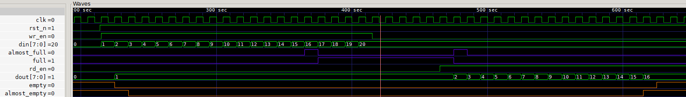
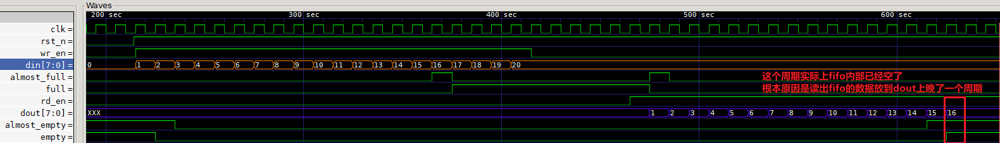

# verilog-cbb

## 一、brief

verilog common build block.

整理自:

- 蜂鸟E203开源项目: https://github.com/riscv-mcu/e203_hbirdv2
- qyley的仓库: https://gitee.com/qyley/limber-generic
- pulp的仓库: https://github.com/pulp-platform/common_cells
- 徐晓康的仓库: https://gitee.com/xuxiaokang/verilog-function-module---fifo

## 二、module logs

### 2.1 sync fifo

FWFT mode

Normal mode

## 三、existing problems

1. **2025/02/04 当fifo的almost_full、almost_empty阈值条件不为1的时候存在问题。**

	在判断almost_full 和 almost_empty时，当使用的阈值条件不是1的时候，其实现在的做法是有问题的。现在的做法是判断了1个等于阈值的条件来产生almost_full和almost_empy, 当再写或者再读一个的时候，实际上就满/空了。但是当阈值不为1的时候，TH-1, TH-2,...1这些情况的时候实际上是almost_full或者almost_emtpy的，没有被考虑到。

